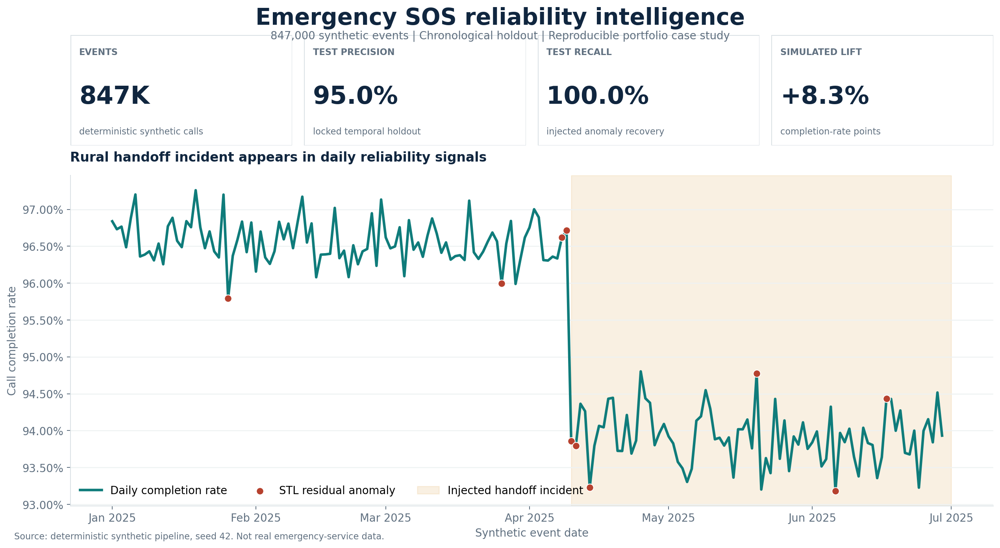
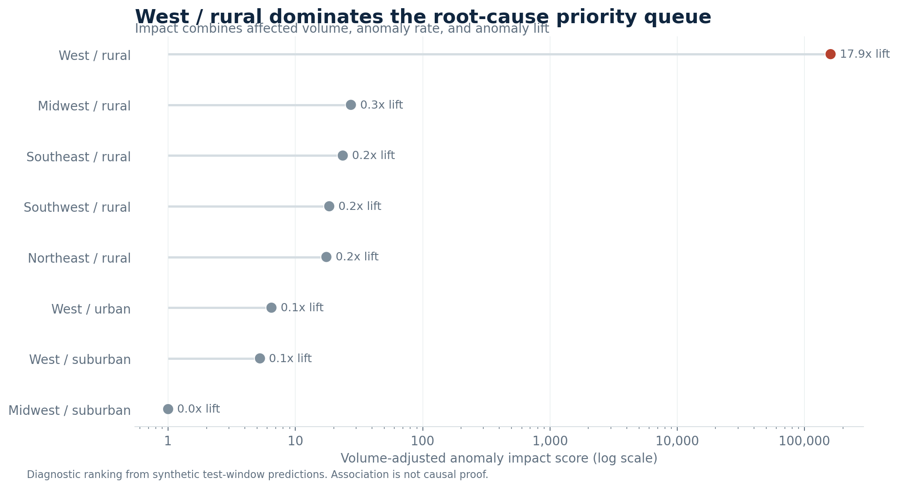
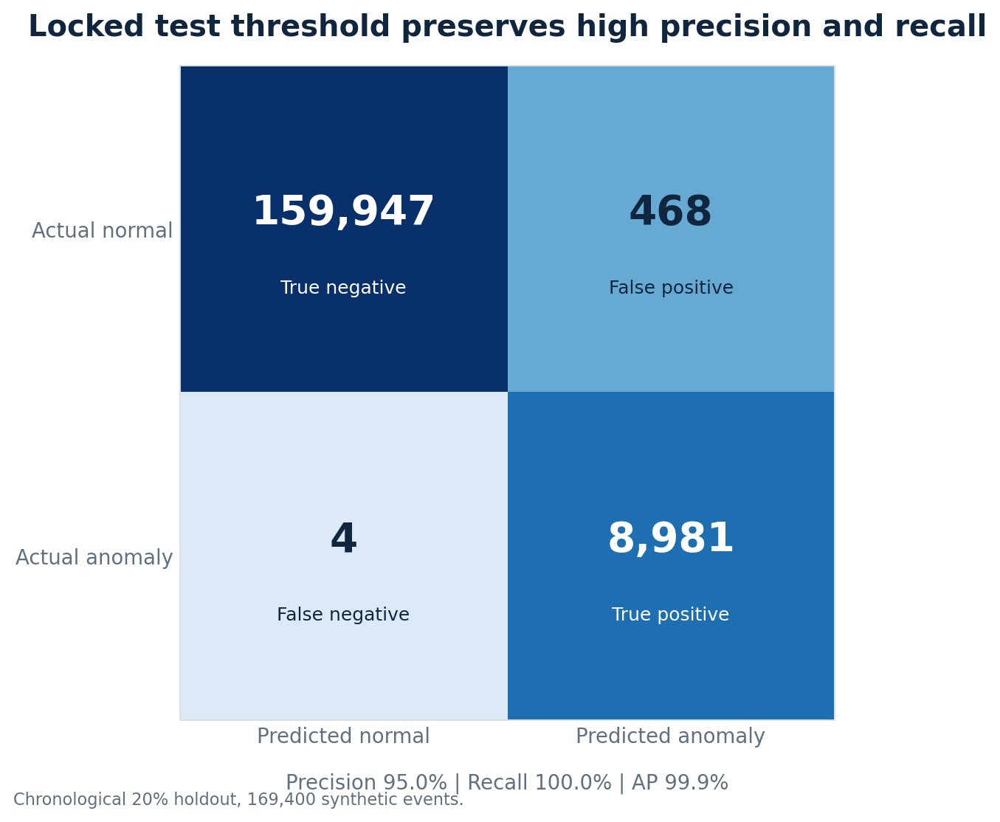
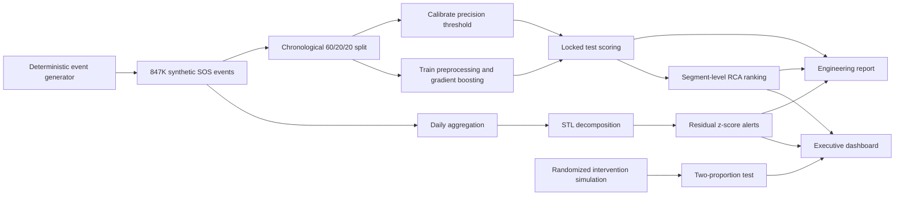

<div align="center">

# Emergency SOS Reliability Intelligence

**An end-to-end machine learning case study for detecting anomalous SOS call failures, isolating operational root causes, and evaluating a simulated remediation.**


</div>



> [!IMPORTANT]
> This is a portfolio demonstration built entirely with deterministic synthetic data. It contains no real emergency calls, customers, devices, carriers, deployments, network-operations validation, or field experiments. The results demonstrate the included methods, not production performance.

## Why this project exists

Headline completion rates can conceal localized reliability failures. This project recreates that analytical problem at portfolio scale: 847,000 synthetic SOS attempts, a time-bounded rural satellite handoff incident, and an end-to-end workflow that moves from anomaly detection to root-cause evidence and intervention measurement.

The pipeline combines:

- **Statistical detection:** robust STL decomposition and residual z-scores expose abnormal failure-rate days.
- **Machine learning:** gradient boosting scores event-level anomalies using only fields available at detection time.
- **Root-cause analysis:** geographic and operational segments are ranked by volume-adjusted anomaly impact.
- **Experiment analysis:** a randomized simulation measures the effect of a handoff-timing fix with a two-proportion z-test.
- **Decision support:** a responsive executive dashboard and an engineering validation report present the same evidence at different levels of detail.

## Reproduced results

The checked full-scale run used seed `42` and a chronological 60/20/20 split.

| Outcome | Reproduced result | Evidence |
|---|---:|---|
| Synthetic SOS attempts | 847,000 | Deterministic generator |
| Test precision | **95.05%** | Locked temporal holdout |
| Test recall | **99.96%** | 8,981 TP, 4 FN |
| Average precision | **99.88%** | Imbalanced ranking metric |
| Root-cause segment | **West / rural** | 17.9x anomaly lift |
| Statistical anomaly days | **10** | Robust STL residuals |
| Simulated completion lift | **+8.27 pp** | 77.51% to 85.78% |
| Experiment p-value | **1.80e-61** | Two-sided proportion test |

The metrics are calculated from generated observations, not hard-coded to match résumé copy. The synthetic target is partly constructed from rural context and extreme handoff latency, which are also model inputs. This deliberate ground-truth design makes the benchmark easier than real incident adjudication and explains the unusually strong ranking performance.

<table>
<tr>
<td width="50%">

</td>
<td width="50%">

</td>
</tr>
</table>

## System design



### Leakage controls

- Events are sorted by time before splitting.
- The first 60% trains the pipeline, the next 20% calibrates the threshold, and the last 20% is evaluated once.
- Numeric scaling and categorical encoding are fit only on the training partition.
- `call_completed`, `failure_reason`, and `is_injected_anomaly` are excluded from model inputs.
- A five-point validation precision margin reduces threshold fragility under modest temporal drift.

## Quick start

### 1. Create an environment

```bash
python3 -m venv .venv
source .venv/bin/activate
python3 -m pip install -e .
```

For the exact dependency versions used to produce the checked artifacts on Python 3.11:

```bash
python3 -m pip install -r requirements-lock.txt
```

### 2. Run the demonstration pipeline

```bash
make demo
```

This generates 100,000 events under `artifacts-demo/` for a fast local run without overwriting the checked full-scale evidence. For the full 847,000-event reproduction:

```bash
make full
```

### 3. Open the outputs

After `make demo`, open `artifacts-demo/reports/executive_dashboard.html`. After `make full`, open `artifacts/reports/executive_dashboard.html`. No dashboard server or JavaScript dependency is required.

| Generated artifact | Purpose |
|---|---|
| `artifacts/data/sos_events.csv` | Synthetic event-level telemetry |
| `artifacts/models/anomaly_model.joblib` | Fitted preprocessing, model, and locked threshold |
| `artifacts/reports/scored_events.csv` | Final temporal holdout scores |
| `artifacts/reports/daily_anomalies.csv` | STL components and residual z-scores |
| `artifacts/reports/root_cause_segments.csv` | Ranked diagnostic segments |
| `artifacts/reports/engineering_report.md` | Engineering-facing methodology and limitations |
| `artifacts/reports/executive_dashboard.html` | Leadership-facing monitoring view |

### 4. Regenerate README graphics

```bash
make visuals
```

This target first reproduces the full 847,000-event run, then rebuilds the visualizations directly from those artifacts. That keeps the project narrative synchronized with the reported evidence in a clean clone.

## Methodology

### Synthetic data generation

The generator creates six months of coarse regional telemetry with signal strength, satellite visibility, handoff latency, weather severity, retries, and call outcomes. Rural calls begin with more difficult connectivity conditions. A West/rural incident adds handoff delay and failure risk from April through June, providing known ground truth for RCA validation without exposing customer or location data.

### Event-level anomaly model

A `HistGradientBoostingClassifier` learns nonlinear interactions among operational features. Preprocessing uses training-only standardization and categorical one-hot encoding. Average precision is the primary ranking metric because injected anomalies are rare.

### Statistical anomaly detection

Daily completion rates are decomposed with robust STL. Large standardized residuals identify unusual days after removing trend and weekly seasonality. This statistical layer complements supervised event scoring without using injected anomaly labels.

### Root-cause analysis

Region and environment segments are compared by predicted anomaly rate, completion rate, median handoff latency, signal strength, and anomaly lift. A volume-adjusted impact score prioritizes the segments most likely to warrant operational investigation. This is diagnostic association, not causal proof.

### Simulated experiment

A reproducible randomized simulation compares original and improved handoff timing. The pipeline computes control and treatment completion rates, absolute and relative lift, z-statistic, chi-square statistic, and p-values from generated outcomes.

## Repository layout

```text
.
├── artifacts/reports/         # Generated dashboard, report, and result summary
├── docs/                      # Architecture, model card, and data dictionary
│   └── images/                # Reproducible README visualizations
├── scripts/                   # Visualization generation
├── src/sos_rca/               # Data, modeling, RCA, experiment, and reporting code
├── tests/                     # Deterministic unit and integration coverage
├── Makefile                   # Demo, full-scale, visual, and test commands
├── pyproject.toml             # Package metadata and dependencies
└── requirements-lock.txt      # Checked dependency snapshot
```

## Verification

```bash
make test
python3 -m ruff check src tests scripts
PYTHONPYCACHEPREFIX=/tmp/sos-rca-pycache python3 -m compileall -q src tests scripts
git diff --check
```

The current repository passes all five unit and integration tests. GitHub Actions runs Ruff and the test suite on Python 3.11. The generated dashboard was also checked at desktop and mobile widths for overflow, semantic structure, synthetic-data disclosure, and browser console errors.

## Documentation

- [Architecture and decisions](docs/architecture.md)
- [Data dictionary](docs/data_dictionary.md)
- [Model card](docs/model_card.md)
- [Engineering validation report](artifacts/reports/engineering_report.md)
- [Machine-readable result summary](artifacts/reports/summary.json)

## Limitations and responsible use

- Synthetic labels are substantially cleaner than real incident labels.
- Device-level correlation, late arrivals, missingness, and carrier effects are not modeled.
- The executive dashboard is a generated analytical snapshot, not a deployed Tableau workbook.
- Geographic detail is deliberately coarse and cannot support operational routing.
- Production use would require privacy and safety review, purged temporal splits, cluster-aware uncertainty, calibrated probabilities, drift monitoring, alert governance, and human incident validation.
- **This project must not be used for emergency-service or other safety-critical decisions.**

## Project status

The portfolio workflow is complete and reproducible. No software license has been selected, so reuse rights are not granted beyond the defaults provided by copyright law.
